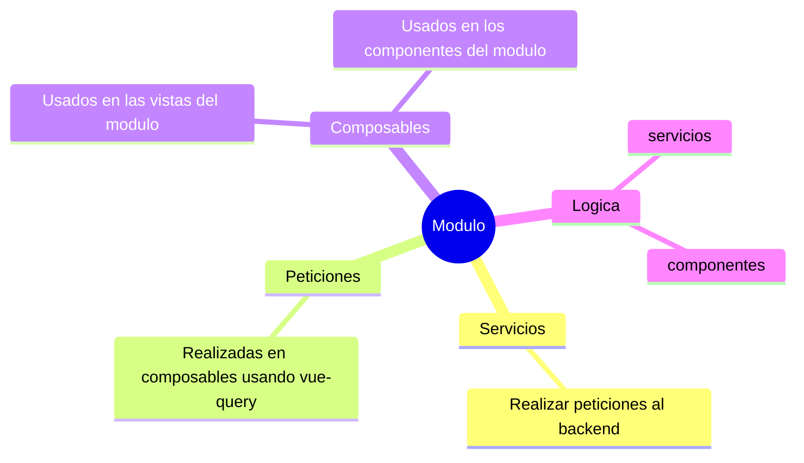

---
# try also 'default' to start simple
theme: default
# random image from a curated Unsplash collection by Anthony
# like them? see https://unsplash.com/collections/94734566/slidev
background: ./assets/images/background/bgIntro.png
# some information about your slides, markdown enabled
title: HANSA CRM4 Frontend
info: |
  ## Presentacion del proyecto frontend CRM4
# apply any unocss classes to the current slide
class: text-center
# https://sli.dev/custom/highlighters.html
highlighter: shiki
# https://sli.dev/guide/drawing
drawings:
  persist: false
# slide transition: https://sli.dev/guide/animations#slide-transitions
transition: slide-left
# enable MDC Syntax: https://sli.dev/guide/syntax#mdc-syntax
mdc: true
---

# Hansa CRM4

Presentacion de la estructura frontend

<div class="pt-12">
  <span @click="$slidev.nav.next" class="px-2 py-1 rounded cursor-pointer" hover="bg-white bg-opacity-10">
    Empezar <carbon:arrow-right class="inline"/>
  </span>
</div>

<div class="abs-br m-6 flex gap-2">
  <button @click="$slidev.nav.openInEditor()" title="Open in Editor" class="text-xl slidev-icon-btn opacity-50 !border-none !hover:text-white">
    <carbon:edit />
  </button>
  <a href="https://github.com/slidevjs/slidev" target="_blank" alt="GitHub" title="Open in GitHub"
    class="text-xl slidev-icon-btn opacity-50 !border-none !hover:text-white">
    <carbon-logo-github />
  </a>
</div>

---
## transition: fade-out
---

# Características del proyecto frontend

El proyecto tiene las siguientes caracteristicas

- **Monolitico** - Actualmente el proyecto se encuentra centralizado en el proyecto con todos sus modulos.
- **Uso de framework** - El proyecto usa el framework **Quasar** para facilitar la velocidad del desarrollo de modulos.
- **Desarrollado para la Division Automotriz** - El proyecto frontend CRM4 nacio principalmente para satisfacer las necesidades de la division Automotriz, aunque se coordino para ser flexible entre todas las divisiones y ser vendido a otras empresas.
- **Uso de las ultimas tecnologias** - Se ha desarrollado el proyecto usando la ultima tecnologia del ecosistema de Vue en los ultimos años.

<br>
<br>

<style>
h1 {
  background-color: #2B90B6;
  background-image: linear-gradient(45deg, #4EC5D4 10%, #146b8c 20%);
  background-size: 100%;
  -webkit-background-clip: text;
  -moz-background-clip: text;
  -webkit-text-fill-color: transparent;
  -moz-text-fill-color: transparent;
}
</style>

<!--
Comentario para la diapositiva
-->

---
layout: two-cols
layoutClass: gap-16
---

# Table of contents

En la capacitacion se abarcaran los siguientes temas

::right::

<Toc v-click minDepth="1" maxDepth="2"></Toc>

---
transition: slide-up
layout: two-cols
layoutClass: gap-16
---

# Stack

El proyecto usa el siguiente stack

- Vue
- Quasar
- Axios
- i18n
- Vue-router
- Pinia
- Moment
- dotenv
- VueUse
- leaflet: Mapas
- Socket.io Client
- Vue-Query

::right::

<br />

- **Vue** - Framework de desarrollo
- **Quasar** - Framework de desarrollo
- **Axios** - Cliente HTTP
- **i18n** - Internacionalizacion
- **Vue-router** - Manejo de rutas
- **Pinia** - Manejo de estado
- **Moment** - Manejo de fechas
- **dotenv** - Manejo de variables de entorno
- **VueUse** - Utilidades de Vue
- **leaflet** - Mapas
- **Socket.io Client** - Websockets
- **Vue-Query** - Manejo de peticiones

---
layout: two-cols
layoutClass: gap-16
---

# Estructura de carpetas

El proyecto tiene la siguiente estructura de carpetas en la rama principal `src`

```plaintext
src/
├── assets/
├── boot/
├── components/
├── composables/
├── conections/
├── css/
├── i18n/
├── layouts/
├── modules/
├── pages/
├── router/
├── services/
├── stores/
├── App.vue
├── env.d.ts
├── quasar.d.ts
├── shims-vue.d.ts
└── vue3-smooth-dnd.d.ts
```

::right::
<br />

Cada modulo se encuentra en la carpeta `modules` y cada modulo tiene su propia estructura de carpetas.

```plaintext
[name_module]/
├── components/
├── composables/
├── router/
├── services/
├── store/
├── views/
└── utils/
```

- Cada modulo se conecta a la ruta principal en el archivo `router/index.ts`

---
layout: two-cols
layoutClass: gap-16
---

# Composición de las rutas

Cada modulo se integra en la ruta principal por medio del archivo `router/index.ts` de cada modulo

- `router/index.ts` - Se encarga de integrar las rutas del modulo a la ruta principal.
- Cada modulo tiene su propia estructura de rutas.

::right::

````md magic-move
```ts {*|9-21|*}
// src/router/routes.ts
const routes: RouteRecordRaw[] = [
  {
    path: "/",
    name: "Home",
    component: () => import("layouts/HomeLayout.vue"),
    meta: {
      isComplete: true,
    },
    children: [
      {
        path: "dashboard",
        name: "dashboard",
        meta: {
          isComplete: false,
        },
        component: () =>
          import(
            /* webpackChunkName: "Home Dashboard" */ "../modules/Dashboard/pages/DashboardPage.vue"
          ),
      },
    ],
  },
];
```

```ts {*|3-6}
// src/router/routes.ts
const routes: RouteRecordRaw[] = [
  // first route path "/"
  {
    path: "/account",
    ...accountRouter,
  },
  {
    path: "/contact",
    ...contactRouter,
  },
  {
    path: "/businesses",
    ...businessesRouter,
  },
  {
    path: "/quotes",
    ...quotesRouter,
  },
  // other modules...
  {
    path: "/:catchAll(.*)*",
    component: () => import("pages/ErrorNotFound.vue"),
  },
];
```

```ts
// src/modules/Accounts/router/index.ts
export default {
  name: "Accounts",
  component: () =>
    import(
      /* webpackChunkName: "accounts" */ "../../../layouts/HomeLayout.vue"
    ),
  meta: {
    nameLabel: "Cuentas",
    requireAuth: false,
    isComplete: true,
  },
  children: [
    {
      path: "",
      name: "accounts",
      meta: {
        isComplete: true,
        nameLabel: "Cuentas",
      },
      component: () =>
        import(
          /* webpackChunkName: "account-list" */ "../pages/viewList/ViewList.vue"
        ),
      props: (route: {
        query: { iduser: string; menu: boolean; record: string };
      }) => {
        return {
          nameModule: "Cuentas",
          idUser: route.query.iduser,
          menu: route.query.menu,
          record: route.query.record,
        };
      },
    },
  ],
};
```
````

---
layout: two-cols
layoutClass: gap-16
---

# Estructura del modulo

Cada modulo tiene la siguiente estructura de carpetas

```plaintext
[name_module]/
├── components/
├── composables/
├── router/
├── services/
├── store/
├── views/
└── utils/
```

::right::

<br />

- `components/` - Contiene los componentes del modulo
- `composables/` - Contiene los composables del modulo
- `router/` - Contiene las rutas del modulo
- `services/` - Contiene los servicios del modulo
- `store/` - Contiene el store del modulo
- `views/` - Contiene las vistas del modulo
- `utils/` - Contiene las utilidades del modulo


---
transition: slide-up
layout: center
---

# Comportamiento de un modulo

Cada modulo maneja un comportamiento similar

````md magic-move
```plaintext
[name_module]/
├── components/
├── composables/
├── router/
├── services/
├── store/
├── views/
└── utils/
```

```plaintext {*|7-10}
[name_module]/
├── components/
├── composables/
├── router/
├── services/
├── store/
    // views contiene las vistas del modulo
    // Se conecta a la store del modulo
    // ViewList.vue - Vista principal
├── views/
└── utils/
```

```plaintext {7-11|*}
[name_module]/
├── components/
├── composables/
├── router/
├── services/
├── store/
    // views contiene las vistas del modulo
    // Se conecta a la store del modulo
    // ViewList.vue - Vista principal
├── views/
├──-- ViewList.vue
└── utils/
```
````

---
layout: center
transition: slide-up
---

# Comportamiento de peticiones

Cada módulo maneja las peticiones de la siguiente manera:

- Los servicios del modulo se encargan de realizar las peticiones al backend.
- Las peticiones se realizan en composables usando vue-query.
- Cada composable es usado en las vistas del modulo y los componentes del modulo.
- La logica de las peticiones se encuentra en los servicios y los componentes.



---
transition: slide-up
layout: center
---

# Ejemplo...

<style>
h1 {
  background-color: #2B90B6;
  background-image: linear-gradient(45deg, #4EC5D4 10%, #146b8c 20%);
  background-size: 100%;
  -webkit-background-clip: text;
  -moz-background-clip: text;
  -webkit-text-fill-color: transparent;
  -moz-text-fill-color: transparent;
}
</style>
